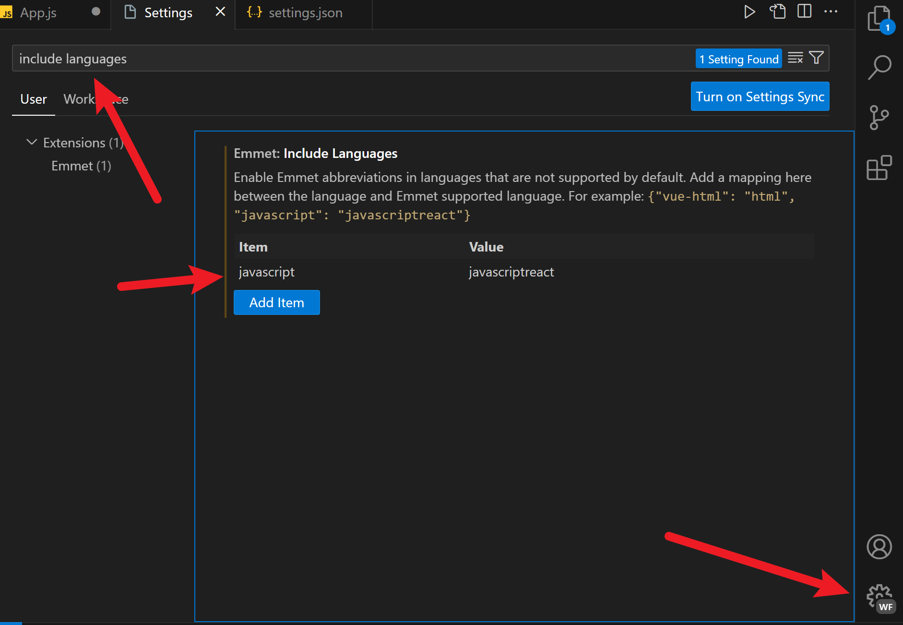

# Welcome to the JavaScript(MERN) stack with Heidi

## Instructions
1. Clone the repo to your computer
1. Pull the repo when you want to get the latest update of the code

## Notes
- Not all the codes in the lecture will be provided
- Make sure you DO NOT submit node_modules to the platform
  - [Tutorial on React assignments](https://youtu.be/KD6Y6G6-Qs0)
  - [Tutorial on Full stack assignments](https://youtu.be/AOTyqFp3EDI)

## keyboard shortcut and useful terminal command
|                             | Windows           | Mac          |
|-----------------------------| ------------------|-------------|
|Stop the server from running | ```Ctrl + C```    | ```Control + C``` |
|Show the list of files in that directory       | ```dir```         | ```ls``` |
|Direct into the folder       | ```cd folder_name```| ```cd folder_name``` |
|Direct one folder up         | ``` cd .. ``` | ``` cd .. ``` | 
|Current folder               | ```pwd```|  ```pwd``` |
|Create a file                | ``` type nul > file_name.js ``` | ```touch file_name.js ``` |
|Create a folder              | ``` mkdir folder_name ``` | ```mkdir folder_name``` |
|Remove a directory and contents |  ```rm -r folder_name``` | ```rm -r folder_name``` |


- To start react server: cd into the react folder, ```npm start```
- To start the express backend server: cd into the folder with package.json for backend, ```nodemon server.js``` (if the filename of the entry point is server.js)

## Adding VS code setting
If you want to have the html emmet, other than creating components using jsx, you can also add that in your setting. 



Or 
in settings.json
```
  "emmet.includeLanguages": {
        "javascript": "javascriptreact"
  }
```
## Common errors

### To kill a running port
1. run the first command to get the PID of the port
2. kill the port with the PID. 

    #### **Mac/Linux**
    - to getting the background process and find the PID
    ```lsof -i:8000 ```

    - To kill the PID
    ```kill -9 <PID> ```

    #### **Windows**
    - to getting the background process and find the PID
    ```netstat -ano | findstr :8000```
    - To kill the PID
    ```taskkill /PID <PID> /F ```