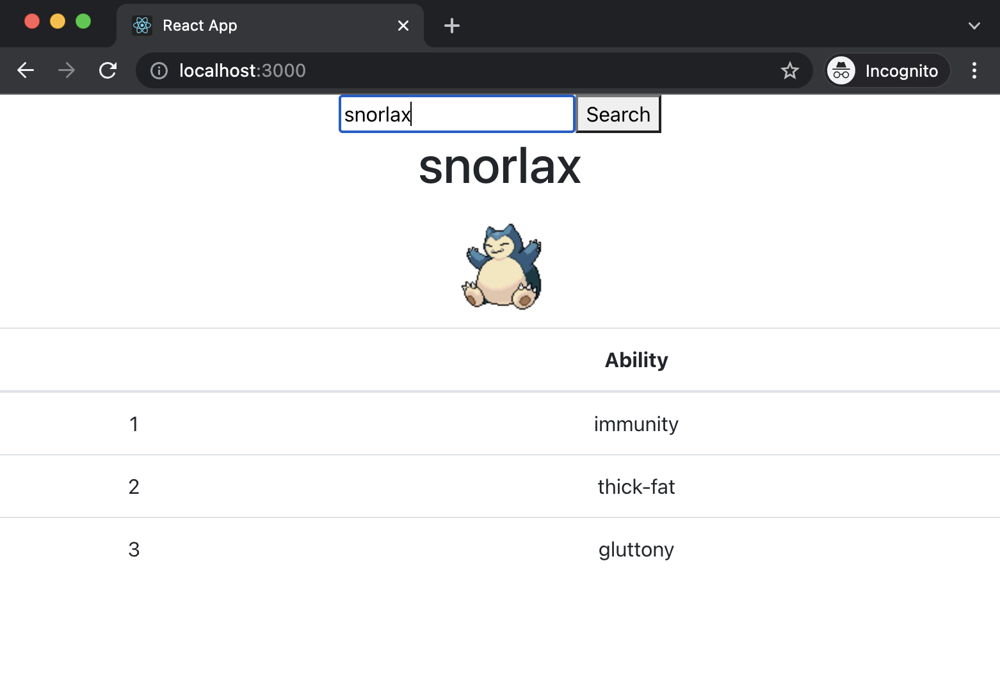

# Pokemon Challenge

## Tasks
1. Create a search bar to search for a pokemon 
2. After hitting search, fetch the pokemon using axios
3. Display the information 
There are a lot of different approaches in completing the task. You can make use of what you have learnt last week and make use of useEffect.
4. Extra challenge: Make the form & display as sibling components (Lifting state)
